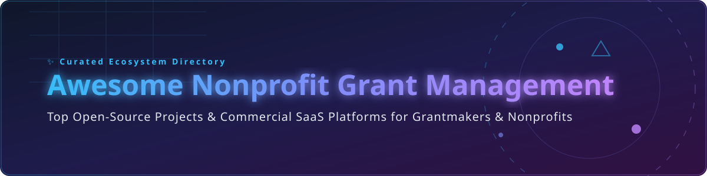

# 🎁 Awesome Nonprofit Grant Management Systems 🚀

  
  
  
  

## 🌟 Top Grant Management (Nonprofit & Foundation) Ecosystem

**A Curated List of Commercial SaaS Products & Open-Source GitHub Projects for Nonprofit Grantmaking, Grant Lifecycle Management, Application Intake, Review Workflows, Compliance, & Reporting**

---

### 📊 Market Overview & Sector Insights

> 💡 **Estimated Market Size & Industry Dynamics:**  
> The global Grant Management Software market is estimated at **$2.6B – $3.2B (2026)** and projected to expand to **$5.8B – $8.9B by 2033–2035** at a CAGR of **10.5% – 12.6%**.  
> The sector is **moderately fragmented**, featuring established enterprise software incumbents (e.g., Blackbaud, Fluxx, SmartSimple) alongside rapidly growing mid-market platforms (Submittable, Good Grants) and specialized compliance tools.

---

## 📑 Table of Contents

- [🏢 SaaS/Hosted Platforms](#-saashosted-platforms)
- [🔓 Open-Source GitHub Projects](#-open-source-github-projects)
- [🤝 How to Contribute](#-how-to-contribute)
- [⚠️ Disclaimer](#%EF%B8%8F-disclaimer)
- [💖 Support & Sponsorship](#-support--sponsorship)
- [📈 Star History](#-star-history)

---

## 🏢 SaaS/Hosted Platforms

| Platform | Starting Tier Price 💳 | Free Tier / Trial Limit ⏳ | Financial Scope (Revenue / Valuation) 💰 | Overview & Key Strengths 📝 |
| :--- | :--- | :--- | :--- | :--- |
| **[Blackbaud Grantmaking](https://www.blackbaud.com/)** | ~$15,000 / year (Custom quote) | No free tier or public free trial | **~$1.12 Billion** Annual Revenue | Leading enterprise fundraising and grantmaking suite for large foundations & institutions. |
| **[Submittable](https://www.submittable.com/)** | ~$39 / month (Literary/CLMP) or Custom Enterprise | No free tier; Submitters account is free | **~$66.6 Million** Annual Revenue | Flexible form builder, application intake, and peer review workflows for grants & CSR. |
| **[Fluxx](https://www.fluxx.io/)** | Custom quote (Grantmaker) / $14.99/mo (Grantseeker) | Free Basic Tier available for Grantseeker | **~$22.0 Million** ARR | Premium foundation grantmaking platform covering multi-stage review & compliance. |
| **[AmpliFund](https://www.amplifund.com/)** | ~$10,000 / year (Custom quote) | No free tier; Demo upon request | **~$18.4 Million** Revenue (Acquired by Euna Solutions) | Specialized grant lifecycle management focused on federal/OMB compliance & performance tracking. |
| **[SmartSimple Cloud](https://www.smartsimple.com/)** | Custom implementation + quote | No free tier; Tailored demo environment | **~$16.5M – $24.0 Million** ARR | Deeply configurable workflow automation engine for research, foundation grants, & complex funding. |
| **[Foundant GLM](https://www.foundant.com/)** | ~$4,000 / year | No free tier; Guided trial available | **~$5.0 Million** Estimated Revenue | Intuitive, full-lifecycle grant management software tailored for community foundations & mid-sized grantmakers. |
| **[WizeHive Zengine](https://www.wizehive.com/)** | Custom quote | No free tier; Demo upon request | **~$4.6M – $5.3 Million** Revenue (Acquired by Submittable) | Configurable application, review, scholarship, and grant management workspace. |
| **[Good Grants](https://www.goodgrants.com/)** | $3,950 / year (Intro Plan) | **14-day Free Trial** (No credit card required) | Private SME Platform | Modern, user-friendly grantmaking software for applications, judging, and award allocation. |

---

## 🔓 Open-Source GitHub Projects

| Open-Source Project | GitHub Stars ⭐ | Description & Scope 🛠️ |
| :--- | :--- | :--- |
| **[Odoo](https://github.com/odoo/odoo)** |  | Enterprise open-source ERP framework with customizable accounting, budget, and project tracking modules used for grant management. |
| **[ERPNext](https://github.com/frappe/erpnext)** |  | Comprehensive open-source ERP system featuring non-profit doctypes, budget control, and expense management. |
| **[LimeSurvey](https://github.com/limesurvey/limesurvey)** |  | Open-source online survey & application tool for structured intake, eligibility screening, and grant submissions. |
| **[Form.io JavaScript API](https://github.com/formio/formio.js)** |  | Combined JSON schema form builder and rendering engine for building complex application and review portals. |
| **[CiviCRM Core](https://github.com/civicrm/civicrm-core)** |  | Open-source constituent relationship management (CRM) designed for non-profits and extensible for grant tracking. |
| **[KoboToolbox KPI](https://github.com/kobotoolbox/kpi)** |  | Primary web user interface for KoboToolbox, widely used for humanitarian funding, impact reporting, and field data collection. |
| **[Microsoft Nonprofit Grant Accelerator](https://github.com/microsoft/Nonprofits)** |  | Open data model and Power Platform accelerator specifically built for managing grant allocations, applications, and disbursements. |
| **[Galette](https://github.com/galette/galette)** |  | Lightweight open-source membership & financial contribution management system for non-profit organizations. |
| **[Navari Grants Management (ERPNext)](https://github.com/navariltd/navari_gms)** |  | Dedicated grant management module for ERPNext, facilitating grant proposals, applicant evaluation, awarding, and closeouts. |

---

## 🤝 How to Contribute

1. **Fork** the repository.
2. **Add or update** entries in `README.md` keeping formatting consistent with tables.
3. **Provide details:** Name, link, 1–2 sentence description, category, and pricing / repository metrics.
4. **Submit a Pull Request** with a clear explanation of changes.

---

## ⚠️ Disclaimer

- This list is **community-curated** for educational purposes and does not constitute an endorsement.
- Grant management involves sensitive financial and regulated data. Proper security, compliance, audit trails, and access controls are essential.
- Always evaluate total cost of ownership (TCO), maintenance requirements, and data sovereignty policies before selecting a solution.

---

## 💖 Support & Sponsorship

If you find this repository helpful, consider supporting the project! Your contributions help maintain and expand open resources for the nonprofit community.

- 🌟 **Star this repository** to help others discover it!
- 🔀 **Fork & Share** with your colleagues and operations team.
- ☕ **Buy me a coffee / Sponsor:** [GitHub Sponsor Dashboard](https://github.com/sponsors/ishandutta2007)

---

## 📈 Star History

---

Made with ❤️ for foundation staff, grant managers, nonprofit operators, and social sector technologists.

